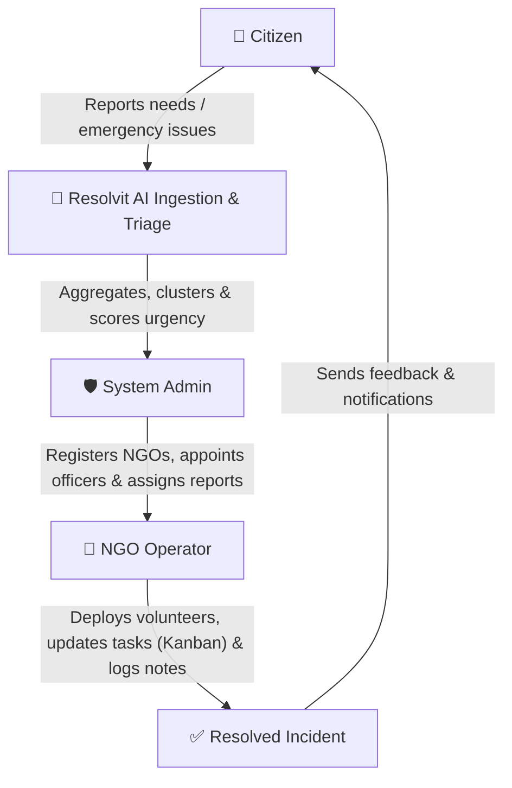
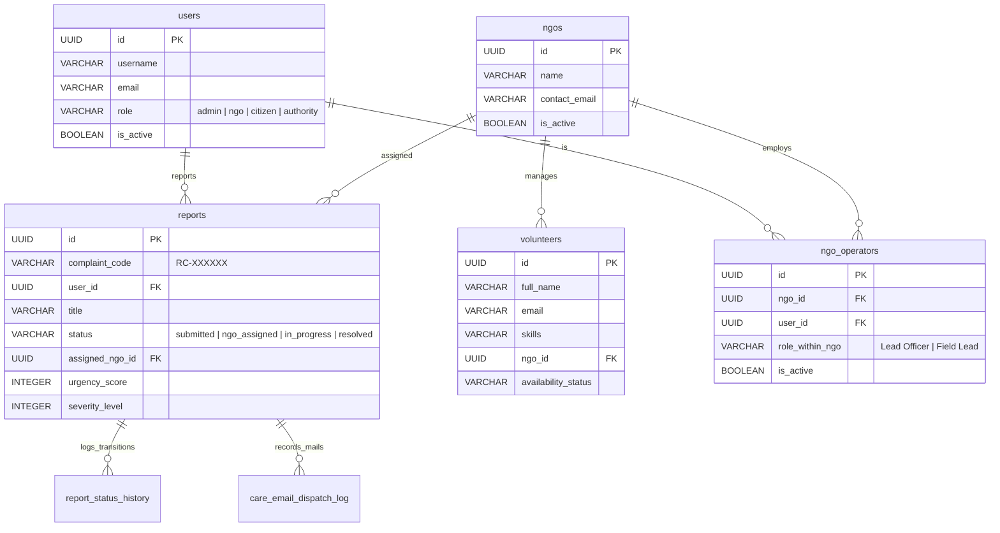

# Resolvit NGO & Care Operations Subsystem Manual

Welcome to the comprehensive system walkthrough for the **Resolvit Care & NGO Operations** subsystem. This document outlines exactly how the platform coordinates civic emergencies, how each user role (Citizen, NGO Operator, and Administrator) interacts with the system, and how the underlying technical architecture (database, APIs, and mail services) powers these operations.

---

## 👥 Role Profiles & Capabilities

The platform operates on a three-tier role architecture to ensure seamless triage, secure command coordination, and efficient field mobilization.

| Capabilities & Permissions | 👤 Citizen | 🚀 NGO Operator | 🛡️ System Administrator |
| :--- | :---: | :---: | :---: |
| **Report Emergency Needs (Copilot / Form)** | ✅ Yes | ✅ Yes | ✅ Yes |
| **View Personal Submissions History** | ✅ Yes | ✅ Yes | ✅ Yes |
| **View Real-Time GIS Heatmaps** | ⚠️ Public Aggregates | ⚠️ Assigned Region | ✅ Full Operations |
| **Manage & Register NGO Organizations** | ❌ No | ❌ No | ✅ Yes |
| **Appoint Lead NGO Officers & Send Emails** | ❌ No | ❌ No | ✅ Yes |
| **Access Intake Queue & Triage Logic** | ❌ No | ❌ No | ✅ Yes |
| **Manage Tasks via Task Orchestration (Kanban)** | ❌ No | ✅ Yes (Assigned) | ✅ Yes (Full Board) |
| **Search & Deploy Volunteer Teams** | ❌ No | ✅ Yes | ✅ Yes |
| **Send Emergency Broadcast Alerts** | ❌ No | ❌ No | ✅ Yes |
| **Log Status Updates & Field Progress Notes** | ❌ No | ✅ Yes | ✅ Yes |

---

## 🔄 The NGO Operations Lifecycle (Step-by-Step)

Resolvit coordinates civic emergency resolution from the initial report to final remediation. Below is the operational lifecycle:

```mermaid
sequenceDiagram
    autonumber
    actor Citizen as Citizen User
    participant AI as Resolvit AI Engine
    actor Admin as System Administrator
    participant Mail as Resend Mail Dispatch
    actor NGO as NGO Lead / Operator
    participant DB as Postgres Database

    Citizen->>AI: Submits emergency report (e.g. Ward 12 flood)
    activate AI
    AI->>AI: Urgency Scoring, Geospatial Clustering & Triage Estimation
    AI->>DB: Stores report (status: 'submitted')
    deactivate AI
    
    Admin->>DB: Reviews live Intake queue
    Admin->>Admin: Selects optimal NGO & Officer
    Admin->>DB: Assigns report (status: 'ngo_assigned') & links NGO Operator
    
    activate Mail
    Admin->>Mail: Triggers lead officer appointment
    Mail-->>NGO: Dispatches premium HTML appointment notification email
    deactivate Mail

    NGO->>DB: Logs in (receives workspace & assigned data)
    NGO->>DB: Views GIS mapping & assigned incidents
    NGO->>DB: Search volunteers and coordinates logistics

    rect rgb(15, 23, 42)
        note over NGO, DB: Task Orchestration (Kanban Board Workflow)
        NGO->>DB: Drags card to IN PROGRESS (PATCH status: 'in_progress')
        NGO->>DB: Logs operational notes & deploys field teams
        NGO->>DB: Drags card to RESOLVED (PATCH status: 'resolved')
    end

    DB-->>Citizen: Dispatches automated resolution receipt email
```

### 📍 Step 1: Citizen Report Ingestion & AI Triage
1. **Submission**: A Citizen encounters a public threat (e.g., flooding, structure collapse, water contamination) and reports it via the **Resolvit AI Copilot** or the *Report a Need* web form.
2. **AI Processing**: The backend AI Engine processes the intake dynamically:
   * Estimates **impact scale** (affected population count).
   * Automatically calculates an **Urgency Score** (e.g., 98/100) based on severity indices.
   * Clusters the report with similar nearby reports in a 500m radius (GIS spatial aggregation).
   * Persists the record in the `reports` table with initial status `'submitted'`.

### 📍 Step 2: Admin Intake Control & Allocation
1. **Unified Intake**: The System Administrator monitors the **Unified Intake Dashboard**, where live, AI-triaged reports are prioritized by urgency.
2. **NGO Allocation**: For high-urgency reports requiring direct intervention, the Admin assigns a registered NGO (e.g. *Likith Impact Foundation*).
3. **Lead Appointment**: The Admin appoints a Lead Officer (e.g., *likith.anumakonda@gmail.com*) to manage the crisis.
4. **Email Dispatch**: The system immediately calls the **Resend API** to dispatch a beautifully structured HTML assignment notification, laying out coordinates, responsibilities, and a call-to-action redirect link.

### 📍 Step 3: NGO Operations Intake & Field Mobilization
1. **Workspaced Portal**: The NGO Operator logs in and is greeted by their custom dashboard. The sidebar navigations filter to show their operational widgets.
2. **Geo-Intelligence Mapping**: The operator studies the GIS map layer, which dynamically renders real-time pins corresponding only to reports assigned to their NGO.
3. **Volunteer Deploys**: Using the *Volunteer Network* panel, the operator searches for registered emergency volunteers based on required skillsets (e.g., *search & rescue*, *first aid*) and language capabilities, deploying them to the disaster coordinates.

### 📍 Step 4: Dynamic Task Orchestration (Kanban Flow)
1. **Interactive Workflow**: The NGO Operator transitions the task across the **Task Orchestration board** using smooth **HTML5 Drag-and-Drop** logic:
   * **Assigned**: The report sits as a fresh card.
   * **In Progress**: When mobilized, the operator drags the card into **In Progress**. The UI triggers an optimistic state transition, dispatching a secure `PATCH` call to `/api/care/ngo/reports/{id}/status`.
   * **Logging Notes**: Operators can add real-time operational updates (internal or public) directly to the task.
2. **Verification & Audit**: The database updates the audit log and status histories synchronously, maintaining an immutable event timeline.

### 📍 Step 5: Resolution & Impact Logging
1. **Resolution**: Once the incident is completely cleared, the Operator drags the card into **Resolved**.
2. **Citizen Feedback**: The citizen who reported the issue is instantly notified via automated email, detailing the resolution summary.
3. **KPI Upgrades**: Global metrics—such as Lives Impacted, Active Incidents, and average response times—are updated globally across all admin boards.

---

## 🗄️ Database Architecture & Audit Logs

The subsystem is modeled on top of a highly optimized PostgreSQL relational schema, ensuring referential integrity and tracking detailed audit trails:

* **`care_audit_log`**: Records all system interactions (`actor_user_id`, `actor_role`, `action_type`, `entity_type`, `entity_id`). It is used to render the live **Ops Timeline** for administrators.
* **`report_status_history`**: Maintains a detailed audit trail of status updates, recording `old_status`, `new_status`, `changed_by_user_id`, `change_reason`, and custom operator/admin annotations.
* **`care_email_dispatch_log`**: Logs every emergency notification dispatched via **Resend**, recording recipient, subject, full body snapshots, and delivery statuses.

---

## 📡 REST API & Gateway Routing

The dashboard connects to the PostgreSQL backend cluster via a series of secure, role-restricted REST endpoints:

### 🛡️ Care Admin Gateways (`/api/care/admin/*`)
* `GET /api/care/admin/overview`: Computes real-time overview metrics (active incidents, lives impacted, connected NGOs) and active operations audit logs.
* `GET /api/care/admin/reports`: Lists all Care reports in the database regardless of assignment.
* `POST /api/care/admin/reports/{report_id}/assign-ngo`: Links a report to a specific NGO and updates its status to `ngo_assigned`.
* `PATCH /api/care/admin/reports/{report_id}/status`: Empowers system administrators to override, escalate, or clear any status.
* `POST /api/care/admin/broadcasts`: Dispatches critical, high-priority emergency alerts globally.

### 🚀 Care NGO Gateways (`/api/care/ngo/*`)
* `GET /api/care/ngo/reports`: Queries all reports currently assigned to the active NGO operator's organization.
* `PATCH /api/care/ngo/reports/{report_id}/status`: Authorizes active NGO operators to progress their assigned reports through Kanban stages.
* `GET /api/care/volunteers`: Direct search queries across the disaster responder and community volunteer directories.

### 👤 Care General Gateways (`/api/care/*`)
* `POST /api/care/reports`: Allows citizens or field responders to file a new emergency need.
* `GET /api/care/reports/mine`: Pulls submissions recorded by the active logged-in account.
* `GET /api/care/map-data`: Serves optimized geo-coordinate JSON payloads for spatial leaflet maps.
* `POST /api/care/reports/{report_id}/notes`: Submits real-time updates and field coordination notes.
